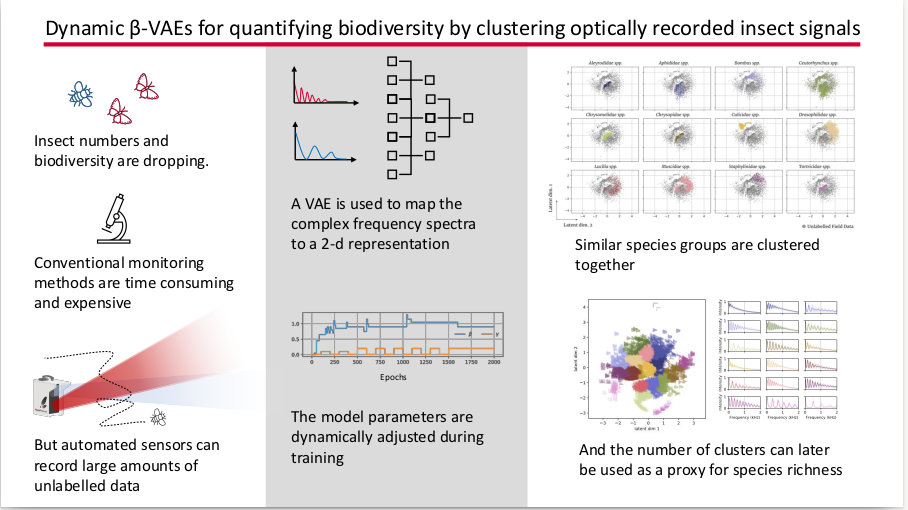

# README #
Dynamice _beta_ Variational Auto Encoder (VAE) for biodiversity assessment of insect signals. 
A fully unsupervised model is outperforming conventional methods, such as PCA whereas a semi-supervised method improves upon the unsupervised model results even further.

This code is made publicly available together with the article 
[Dynamic beta VAEs  for quantifying biodiversity by clustering optically recorded insect signals](https://arxiv.org/abs/2102.05526), Klas Rydhmer and Raghavendra Selvan, accepted for publication by Ecological Informatics, 2021-10-05.

### What is this repository for? ###

This repository provides a minimum working example of the code. As the insect signals used in the published work are used commercially by FaunaPhotonics, they are not included in this repository. Instead, a framework for generating synthesized signals is provided.



### How do I get set up? ###

* Basic Pytorch dependency
pip install -r requirements.txt

* Tested on Pytorch 1.3, Python 3.6 

* Synthesize new sample data:  
python Synthesize_signals.py

* Train the model from scratch: 
python DynamicBetaVAE.py

### Usage guidelines ###

* Kindly cite our publication if you use any part of the code
```
@article{rydhmer2021dynamicVAE,
 	title={Dynamic beta VAEs  for quantifying biodiversity by clustering optically recorded insect signals},
	author={Klas Rydhmer and Raghavendra Selvan},
	journal={Ecological Informatics},
	month={October},
 	note={arXiv preprint arXiv:2102.05526},
	year={2021}}
```

### Who do I talk to? ###

* kkgr@ign.ku.dk

### Press coverage
* University of Copenhagen press release. [en](https://science.ku.dk/english/press/news/2022/insect-wingbeats-will-help-quantify-biodiversity/) [da](https://science.ku.dk/presse/nyhedsarkiv/2022/insekters-vingeslag-skal-fortaelle-os-hvordan-det-gaar-med-biodiversiteten/) 
* Other coverage in Danish. [1](https://videnskab.dk/teknologi-innovation/ny-dansk-opfindelse-insekters-vingeslag-kan-bruges-til-at-overvaage)
* Other coverage in English. [1](https://cphpost.dk/?p=131520)


